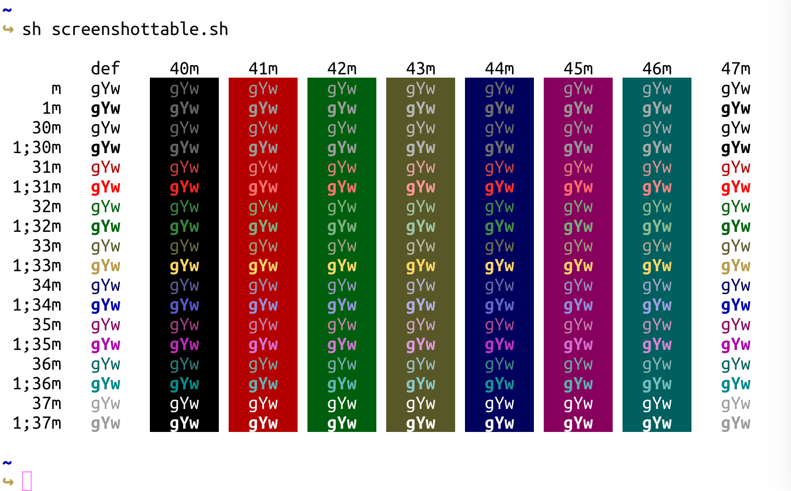

<h1 align="center">🎉 shirotelin for iTerm2 🎉</h1>

[Shirotelin](https://github.com/yasukotelin/shirotelin) is an ultimate standard light colorscheme originally for vim.
This is one for iTerm2.

## Screenshots

## Licence

MIT Licence
